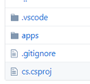

# Installation

## Install the Hass.io add-on

1. Add the `https://github.com/helto4real/hassio-add-ons` in `Add new repository URL` to the add-on store.

    

2. Add the NetDaemon add-on.

    

3. After you install it, do not start it just yet. We need to configure some stuff manually (will be improved as we come closer to release)

## Download the development environment

Development of apps is currently recommended doing locally. A vscode development devcontainer has been prepared for you at [https://github.com/helto4real/hassio-add-ons/tree/master/netdaemon](https://github.com/helto4real/hassio-add-ons/tree/master/netdaemon). Clone the folder netdaemon to your local maching. The folder should be containing the following files:

## Open the content in vscode

1. Make sure you installed Remote Development extension in vscode
2. Open the `netdaemon` folder and select open as container. Wait for the container to be created.
3. Configure the config.json properly
4. Open the vscode terminal and run `dotnet restore`, this needs to be done to get intellisense to work properly. Sometimes you need to restart vscode once for it to work.
5. Hack away! Run and debug your stuff! There are a few code snippets (ctrl+space) you can use. There will be more later.

## Deploy your apps

After you have developed and tested you app you want to copy the whole app to the config folder. The new folder structure should be /config/netdaemon/apps where /config is the path to your Home Assistant config.

## Start the add-on

Now you can start the plugin, check the logs for any errors.

> **IMPORTANT - YOU NEED TO RESTART THE ADD-ON EVERYTIME YOU MAKE CHANGES TO A FILE. THIS WILL CHANGE IN FUTURE RELEASES!**

## Check out the examples in docs

Todo: make link to examples here..

My own automations can be found at : [https://github.com/helto4real/hassio/tree/master/netdaemon/apps](https://github.com/helto4real/hassio/tree/master/netdaemon/apps).
